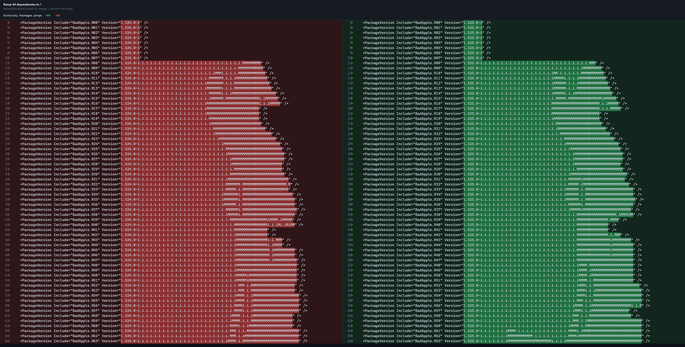

# Bad Apple!!, but it's Dependabot

6,562 frames. 6,562 pull requests. Every one drawn by `dependabot[bot]`, not me.

It had no choice — that's the whole trick.

(It cost 419,968 NuGet packages. Keep scrolling.)



Every open PR in this repo is one frame. Open any of them → **Files changed** →
squint. That's Marisa Kirisame, made of NuGet package versions.

## The trick

Each frame is a branch (`frame-0001` … `frame-6562`). Each branch has one
project file pinning 64 packages — one per pixel row — at a blank version:

```xml
<PackageReference Include="BAF0525L00" Version="1.525.0-0" />
```

No file here contains any image data. The picture is the *newer* version I also
published, whose prerelease tag is a row of pixels:

```
1.525.0-0                                          ← the pin (blank)
1.525.0-i.i.i.i.iMMMMMMMMMMMMMMMM.i.i.i.i.i.i.i.ii ← the ink (M = pixel)
```

Both are valid SemVer. And SemVer only lets a pinned prerelease move to a newer
prerelease of the same release — so Dependabot's one legal move is `-0` → the
pixels. It doesn't know it's drawing. It thinks it's doing its job.

The PRs are never merged. The open-PR list *is* the animation.

## Why 419,968 packages

First attempt used 64 shared packages for the whole film. By the halfway point
each had ~11,000 versions, the version lists ballooned to half a megabyte, and
Dependabot's jobs timed out mid-draw.

Fix: give every frame its own 64 packages (`BAF<frame>L<row>`). Now each package
has exactly two versions, forever, and every update resolves instantly. Cost:
6,562 × 64 = 419,968 packages.

## FAQ

**Is it real?** Real. Authored by the actual `dependabot[bot]` on GitHub's
servers. Any PR → Files changed → check the author.

**What's the `.i.i.i` texture?** `..` is invalid SemVer and `-` renders as a
line, so `.i` is the least-ugly legal "background" — full width, every row.

**How long to fill all 6,562?** About a week. GitHub runs only so many
Dependabot jobs at once; the open-PR count is the progress bar.

**Did NuGet ban you?** These are on GitHub Packages, not nuget.org.
